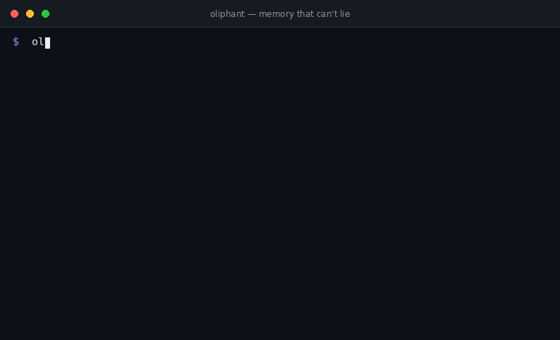

<div align="center">

```
      ___
   .-'   '-.
  /  o   o  \        o l i p h a n t
 |    <3     |       never forgets.
  \  \_/    /        never lies.
   '-.___.-'
```

# oliphant

**Git-native, self-verifying memory for coding agents.**

Every memory ships with **receipts** — file paths, grep patterns, commands.
When reality changes and a memory stops being true, `oliphant doctor` catches it,
and your **CI fails until a human retires the lie**.

[](.github/workflows/ci.yml)
[](package.json)
[](package.json)
[](LICENSE)
[](src/mcp.js)

*Zero dependencies. Zero cloud. Zero daemons. Your memory is just files in your repo — versioned in git, reviewable in PRs, owned by your team.*

</div>

## The 30-second demo

<p align="center">
  
</p>

*A memory lies → `doctor` re-runs its receipts → CI exits 1 → a human `forget`s it. Loop closed.*

---

## The problem

Your coding agent is a goldfish with a README.

- **Every session starts from zero.** The agent re-discovers that the repo uses bun, that `api.ts` is generated, that test env needs `DATABASE_URL=...` — again and again, burning your tokens and your patience.
- **`AGENTS.md` rots.** The "always edit `src/gen/` not `src/gen.out/`" note was true eight months ago. The agent still believes it. Nobody updates docs that live outside the code — so agents confidently execute expired instructions.
- **"Memory" products are the wrong shape.** Vector DBs, embeddings, cloud dashboards, per-user memory for chatbots — built for app developers, not for *your repo and your team*. Meanwhile Cursor/ChatGPT "memories" are locked inside one vendor.

**oliphant is a different bet: memory is a repo artifact — like `go.mod`, `package.json` or `.editorconfig`. Versioned. Reviewed in PRs. Shared by every agent and every human on the team. And above all: *honest by construction*, because every claim carries receipts that get re-verified against your actual code.**

## 60-second demo

```console
$ oliphant remember "auth proofs are HMAC-SHA256, never store plaintext" \
    --kind decision --tag auth \
    --evidence path:src/auth.js --evidence "grep:createHmac@src"
✓ remembered mem_06f0ba952b3a
  receipts: path:src/auth.js, grep:createHmac@src

$ oliphant compile
◍ AGENTS.md · CLAUDE.md · .cursor/rules/oliphant.mdc · .claude/skills/oliphant/SKILL.md

$ oliphant recall "how does auth work?"
[decision] auth proofs are HMAC-SHA256, never store plaintext
    receipts: path:src/auth.js, grep:createHmac@src
```

…six weeks later, someone refactors auth away:

```console
$ oliphant doctor
────────────────────────────────────────────────────────────────
🩺 oliphant doctor
────────────────────────────────────────────────────────────────
✗ dead  0.31  decision: auth proofs are HMAC-SHA256, never store plaintext
      ✗ path:src/auth.js — missing
      ✗ grep:createHmac — pattern /createHmac/ not found under src
      → retire (run: oliphant forget mem_06f0ba952b3a)
✓ ok   0.85  fact: CI runs node --test before any merge
      ✓ command:npm test — exit 0
────────────────────────────────────────────────────────────────
  freshness [██████░░░░] 58%   (ok 1 / rotting 0 / dead 1)

$ oliphant forget mem_06f0ba952b3a "refactored away in #482"
◍ retired — kept in the journal (memory is never silently deleted)
```

In CI, `oliphant doctor --ci` **exits 1 while any un-retired memory is dead**. A lie can't hide: it stays on the bill until a human kills it.

## Install

```bash
npm i -D oliphant        # or: npx oliphant init (no install needed)
oliphant init            # scaffolds .memory/ inside the repo
```

That's it. `oliphant init` also generates `AGENTS.md` + `CLAUDE.md` (they start empty), and you commit `.memory/` like any other file.

## The three mechanisms

### 1 · Receipts — memory that shows its work

A memory is not a vibe. It's a claim plus evidence, stored in `.memory/journal.jsonl` (append-only, event-sourced) and materialized to `memories.json`:

```json
{
  "id": "mem_06f0ba952b3a",
  "claim": "auth proofs are HMAC-SHA256, never store plaintext",
  "kind": "decision",
  "tags": ["auth", "security"],
  "evidence": [
    { "type": "path",  "value": "src/auth.js" },
    { "type": "grep",  "value": "createHmac", "path": "src" },
    { "type": "command", "value": "npm test" }
  ],
  "ts": "2026-09-27T03:03:00Z"
}
```

| receipt type | stays true while… | fails when… |
|---|---|---|
| `path:src/auth.js` | the file exists | deleted/renamed |
| `grep:pattern@dir` | the pattern appears under `dir` | the code moved on |
| `command:npm test` | the command exits 0 | the invariant broke |

### 2 · Rot — honesty has a half-life

`doctor` re-runs every receipt against the current tree. Then each memory gets a score: `freshness = confidence × 0.5^(days/halfLife) − 0.15×failures + 0.05×verifications` (default half-life 30 days, tune in `.memory/config.json`). Memories that keep passing checks get *stronger*; memories that fail rot. Compilation ranks by freshness, so your context budget is spent on memory that is still true.

### 3 · Retire — dead memory needs a funeral

A dead memory never silently disappears. It stays in every doctor report and keeps failing CI until a human runs `oliphant forget <id> <reason>`. The record is kept in the journal forever — with the reason — so future agents (and humans) can see *what was believed and why it died*. **Forgetting is a decision, not a default.**

## Wire it into your agent

### MCP (Claude Code, Cursor, Codex, anything speaking Model Context Protocol)

```bash
claude mcp add oliphant -- npx -y oliphant serve
```

Four tools appear: `oliphant_recall` (before assuming how the repo works), `oliphant_remember` (after durable decisions), `oliphant_doctor`, `oliphant_stats`. The server is hand-rolled JSON-RPC over stdio — **zero dependencies, ~200 lines, auditable in one sitting.**

### Compiled files (everyone else)

`oliphant compile` writes a token-budgeted block (default 2000 tok) into the files agents actually read:

| file | consumed by |
|---|---|
| `AGENTS.md` | Codex, Gemini CLI, OpenCode, Factory, … |
| `CLAUDE.md` | Claude Code (`@AGENTS.md` import + recall pointer) |
| `.cursor/rules/oliphant.mdc` | Cursor |
| `.claude/skills/oliphant/SKILL.md` | Claude Code Agent Skills |

Your own notes live outside the `<!-- OLIPHANT:BEGIN/END -->` block and are never touched. Compile is idempotent — no PR noise.

## CI: fail on lies

```yaml
# .github/workflows/memory.yml
- uses: wsxiaolin/oliphant@v1
  with:
    skip-commands: false   # true if you don't want command receipts in CI
```

Or plain:

```yaml
- run: npx -y oliphant doctor --ci --skip-commands
```

Exit code 1 while un-retired dead memories exist. Rotting ones only warn. That's the whole contract.

## Commands

```
oliphant init                       scaffold .memory/ + agent files
oliphant remember "<claim>"         record memory (with receipts)
  --kind decision|fact|gotcha|pattern|preference
  --tag <t> (repeatable)
  --evidence path:<p> | grep:<pat>@<dir> | command:<cmd>   (repeatable)
  --source "claude-code@session-42"   who taught this
oliphant recall "<query>"           keyword search, ranked by relevance+freshness
oliphant compile                    regenerate AGENTS.md / CLAUDE.md / Cursor / Skill
oliphant doctor [--ci] [--skip-commands] [--json]
                                    re-verify every receipt against reality
oliphant ls                         list all memory with status glyphs
oliphant stats                      counts, freshness, token budget
oliphant forget <id> "<reason>"     retire a memory (journal keeps the corpse)
oliphant serve                      MCP server over stdio
```

## Why not X?

| | lives in your repo | git-versioned, PR-reviewable | self-verifying | zero infra | agent-agnostic |
|---|---|---|---|---|---|
| **oliphant** | ✅ | ✅ | ✅ receipts + doctor + CI | ✅ 0 deps | ✅ MCP + compiled files |
| AGENTS.md by hand | ✅ | ✅ | ❌ rots silently | ✅ | ✅ |
| Mem0 / Zep / Letta | ❌ service | ❌ | partial | ❌ vector DB / cloud | mostly API |
| memory-bank markdown patterns | ✅ | ✅ | ❌ trust me bro | ✅ | ❌ Claude-only-ish |
| vendor "memories" (Cursor etc.) | ❌ | ❌ | ❌ | — | ❌ locked to one product |

oliphant is *not* an embedding database and doesn't want to be. Repo-scale memory is dozens of claims, not millions of chat logs — keyword search with freshness ranking is transparent, deterministic, and debuggable. The moment you need vectors, you'll know.

## Design principles

1. **Memory is a repo artifact.** If it's not in git, it doesn't exist.
2. **No memory without receipts.** A claim you can't verify is a rumor.
3. **Dead memory fails CI.** The lie stays on the bill until a human buries it.
4. **Zero dependencies.** You can read the entire codebase in one coffee. `npm audit` is forever green.
5. **Agent-agnostic.** MCP today; whatever protocol wins tomorrow, compiled markdown still works.

## FAQ

**Is this safe? `command` receipts run shell commands.** Same trust level as `package.json` scripts: receipts come from your own repo's journal, written by your team and your agents, reviewed in PRs. Untrusted? Run doctor with `--skip-commands`, or don't commit command receipts. Receipts never run on install — only when *you* run doctor.

**What about secrets?** Receipts store paths and patterns, never file contents. `doctor` prints only existence/exit codes, never source. Still: don't put secrets in claims, obviously.

**Can I edit `.memory/memories.json` by hand?** Prefer `remember`/`forget` (the journal stays truthful), but yes — it's your repo. `oliphant doctor` will tell you if you break invariants.

**Does it work outside git?** Yes — but you lose the whole point (versioning + PR review). Just use git.

**Monorepos?** One `.memory/` per repo root for now; per-package memory is on the roadmap.

## Roadmap

- [ ] `oliphant revive` — resurrect a dead memory with new receipts
- [ ] `oliphant import` — bootstrap from an existing AGENTS.md / CLAUDE.md
- [ ] doctor badge (SVG) for READMEs
- [ ] per-package `.memory/` for monorepos
- [ ] team analytics: who remembers, what rots most (from the journal)

## Contributing

PRs welcome — it's a small, readable codebase on purpose. `node --test test/` is the whole test story (33 tests, zero deps).

## License

[MIT](LICENSE) — elephants included.
